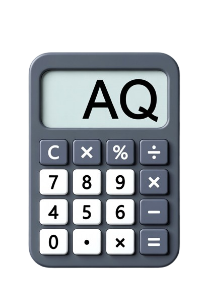

# Calculadora de Adicional de Qualificação (AQ)

<div align="center">



**Formulário Web para Cálculo do Adicional de Qualificação**  
_Baseado nas Leis 11.416/2006 e 15.292/2025_

[](CHANGELOG.md)
[](LICENSE.md)
[](index.html)

[Documentação](PRD.md) • [Changelog](CHANGELOG.md) • [Instalação](#-instalação-e-uso) • [Regras](#-regras-de-negócio)

</div>

---

## 📋 Sobre

Formulário web simples e objetivo para calcular o **Adicional de Qualificação (AQ)** para servidores do Judiciário. O formulário permite que o usuário informe suas titulações, certificações e capacitações e receba automaticamente o cálculo, respeitando rigorosamente as regras de acumulação, limites e tetos previstos na legislação vigente.

## ✨ Funcionalidades

- ✅ **Cálculo Automático**: Resultado atualizado em tempo real conforme preenchimento.
- ✅ **Regras de Negócio**: Aplicação automática de tetos, absorções e vigências.
- ✅ **Validação de Datas**: Verifica vigência de 4 anos para Capacitações e Certificações.
- ✅ **Financeiro**: Exibe o valor final em reais com VR configurável.
- ✅ **Feedback Visual**: Indica claramente o que foi considerado e o que foi descartado.
- ✅ **Zero Dependências**: Funciona offline, sem necessidade de servidor ou instalação.

---

## 🚀 Instalação e Uso

### Versão Online / Local

Este é um projeto **Single Page Application (SPA)** que roda inteiramente no navegador.

1.  **Clone ou Baixe** este repositório.
2.  Abra o arquivo `index.html` em qualquer navegador moderno (Chrome, Edge, Firefox).
3.  **Pronto!** O formulário em si não exige Node.js, Python ou servidor web.

### Governança (desenvolvedores / agentes)

O repositório é um **satélite do Agents Hub** (junction `.agent/hub/`). Para scripts de qualidade, hooks e doctor:

```bash
npm install
npm run doctor:satellite
npm run check:hub
npm run verify
```

Detalhes operacionais: `AGENTS.md` e `.agent/hub/docs/guides/guide-satellite-hub-operations.md`.

### Configuração Inicial

1.  No topo da página, ajuste o **Valor do VR** (Valor de Referência) se necessário (padrão atualizado conforme tabela vigente).
2.  Preencha os campos seguindo a ordem hierárquica (do maior título para o menor).

---

## 📚 Documentação

| Documento                    | Descrição                                                |
| ---------------------------- | -------------------------------------------------------- |
| [PRD.md](PRD.md)             | Product Requirements Document - Especificações completas |
| [AGENTS.md](AGENTS.md)       | Instruções para agentes de IA + governança Hub           |
| [GEMINI.md](GEMINI.md)       | Contrato complementar para CLIs/Gemini                   |
| [CHANGELOG.md](CHANGELOG.md) | Histórico de mudanças do projeto                         |

---

## 📖 Regras de Negócio

### Hierarquia das Titulações

1. **Doutorado** - 5 VR
2. **Mestrado** - 3,5 VR
3. **Pós-graduação lato sensu** - 1 VR cada (máx. 2)
4. **Curso de graduação** - 1 VR (regra especial para Técnicos)
5. **Certificações profissionais** - 0,5 VR cada (máx. 2)
6. **Capacitações (120h)** - 0,2 VR por conjunto (máx. 3)

### Regras Principais

#### Doutorado e Mestrado

- **Não se acumulam** entre si (prevalece a maior)
- **Absorvem** adicionais de menor nível, **exceto** Capacitações (120h)

#### Bloco com Teto de 2 VR

Os seguintes itens **competem entre si** e somados **não podem ultrapassar 2 VR**:

- Pós-graduação lato sensu (1 VR cada, máx. 2)
- Curso de graduação (1 VR, máx. 1)
- Certificações profissionais (0,5 VR cada, máx. 2)

**Priorização automática:**

1. Pós-graduação
2. Curso de graduação
3. Certificações

#### Capacitações (120h)

- **Valor**: 0,2 VR por conjunto que totalize pelo menos 120 horas
- **Limite**: até 3 conjuntos (0 a 3)
- **Acumulação**: Pode ser percebido cumulativamente com qualquer outro adicional
- **Vigência**: 4 anos, contados da última ação que completar o conjunto

#### Certificações Profissionais

- **Valor**: 0,5 VR por certificação
- **Limite**: até 2 certificações (0 a 2)
- **Vigência**: 4 anos, contados da conclusão
- **Teto**: Integra o bloco de 2 VR com Pós-graduação e Graduação

#### Curso de Graduação (Inciso VII)

- **Regra geral**: AQ devido para **segundo curso de graduação** (máx. 1)
- **Exceção**: Técnico Judiciário nomeado com exigência de nível médio pode receber AQ para o **primeiro** curso de graduação
- **Limite**: Mesmo com duas graduações, o adicional é limitado a 1 VR

---

## 🛠️ Desenvolvimento

### Tecnologias Utilizadas

- **HTML5** - Estrutura semântica
- **CSS3** - Estilização moderna (variáveis CSS, Grid, Flexbox)
- **JavaScript (Vanilla)** - Lógica de cálculo e interatividade
- **Sem dependências externas** - Totalmente client-side

### Estrutura do Projeto

```
calcaq-app/
├── index.html       # Aplicação principal
├── style.css        # Folha de estilos
├── app.js           # Lógica de negócio
├── AGENTS.md        # Guia para Agentes de IA
└── README.md        # Documentação
```

### Convenções

- Arquivos: `kebab-case` (ex: `analise-inconsistencias.md`)
- Variáveis JavaScript: `camelCase`
- Classes CSS: `kebab-case` com BEM quando necessário

#### Commits (Conventional Commits)

```bash
tipo(escopo): descrição

# Tipos:
feat: Nova funcionalidade
fix: Correção de bug
docs: Documentação
style: Formatação
refactor: Refatoração
test: Testes
chore: Manutenção
```

---

## ✅ Requisitos Não Funcionais

- ✅ Interface simples e intuitiva
- ✅ Linguagem clara, sem juridiquês
- ✅ Zero necessidade de login
- ✅ Cálculo 100% client-side
- ✅ Compatibilidade com navegadores modernos

---

## 🔍 Validação e Qualidade

### Checklist Pre-Commit

- [ ] Cálculo funciona corretamente para todos os cenários
- [ ] Interface responsiva (mobile e desktop)
- [ ] Sem erros no console do navegador
- [ ] Textos claros e sem ambiguidades
- [ ] Links e referências legais funcionando

### Testes Manuais Recomendados

1. **Cenário 1**: Doutorado + Capacitações (deve absorver outros, exceto capacitações)
2. **Cenário 2**: Teto de 2 VR (testar com combinações que excedam)
3. **Cenário 3**: Vigência de 4 anos (datas válidas e inválidas)
4. **Cenário 4**: Técnico com nível médio (exceção do inciso VII)
5. **Cenário 5**: Múltiplas capacitações (até 3 conjuntos)

---

## 📄 Licença

Este projeto está sob a licença MIT. Veja o arquivo [LICENSE.md](LICENSE.md) para mais detalhes.

---

## ⚠️ Aviso Legal

Este formulário é apenas uma **análise preliminar** e **não constitui ferramenta oficial**. Os resultados são estimativos e podem conter inconsistências. O reconhecimento de títulos, certificações, capacitações e o pagamento do AQ dependem do órgão/tribunal competente, do regulamento interno e das normas aplicáveis.

---

## 🔗 Referências Legais

- [Lei nº 11.416/2006](https://www.planalto.gov.br/ccivil_03/_Ato2004-2006/2006/Lei/L11416.htm)
- [Lei nº 15.292/2025](https://www.planalto.gov.br/ccivil_03/_ato2023-2026/2025/lei/L15292.htm)

---

<div align="center">

**Calculadora AQ** • Desenvolvido com foco em simplicidade e conformidade legal.

</div>
